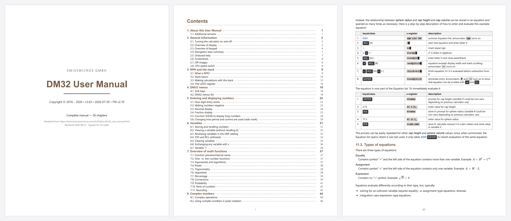

# DM32 User Manual → PDF

The [SwissMicros DM32](https://www.swissmicros.com/en/products/dm32) publishes its user
manual online as a single 1 MB HTML page. That page is not much use on a tablet or an
e-reader, and there is no way to annotate it or keep it available offline.

This is a small pipeline that turns that page into a properly typeset **200-page US Letter
PDF** — bookmarked, page-numbered, with a real table of contents, and with page breaks that
fall where a typesetter would put them rather than wherever the text happened to run out.



## What you get

- **Structural pagination** — chapters start a fresh page, headings never dangle at the foot
  of one, and figures stay with the sentence that introduces them.
- **A generated title page and table of contents** with real page numbers, verified against
  the finished file on every build.
- **Book-convention numbering** — no number on the cover, roman numerals on the contents,
  arabic restarting at 1 for the body.
- **329 PDF bookmarks** from the manual's own heading tree, plus working internal
  cross-references.
- **Sharp screenshots** — images are sized in inches and never upscaled past 220 dpi; the
  worst figure in the full render still lands at 259 dpi.
- **Typeset equations.** The manual's 544 AsciiMath expressions go through MathJax, so they
  look the way they do on the website rather than degrading to raw markup.
- **Faithful colour** — the manual's brown headings and orange/blue shift labels are kept.
- **A monochrome build** — `--greyscale` re-encodes the shift markers as patterned shapes
  and converts every figure, for e-ink readers and laser printers. See [Greyscale](#greyscale).

## Requirements

- **Node.js 18+**
- **Google Chrome, Chromium, or Microsoft Edge** already installed

There is no bundled browser to download: the pipeline uses `puppeteer-core` and drives the
one you already have. Common install locations on Windows, macOS and Linux are probed
automatically — set `PUPPETEER_EXECUTABLE_PATH` if yours lives somewhere unusual.

## Quick start

```bash
npm install && npm run build
```

That is the whole thing. It writes the complete 200-page manual to
`out/dm32_user_manual.pdf`.

The first run pulls 222 images (about 3 MB) and takes a couple of minutes; everything is
cached afterwards, so later builds are just the render — roughly a minute for two full
passes plus a verification pass.

If you would rather see output in a few seconds before committing to the whole thing, build
a three-chapter sample instead:

```bash
npm install && npm run build:sample
```

That writes a 19-page `out/dm32_user_manual_ch1-3.pdf`.

## A note on copyright

**The manual is copyright SwissMicros GmbH. This repository does not contain any of it.**

`fetch-assets.mjs` downloads the manual to a local `cache/` directory at runtime, and the
rendered PDF lands in `out/`. Both are gitignored, deliberately. This is a tool for making
yourself a readable copy of a document that is already published for free — please don't
use it to redistribute SwissMicros' work.

**SwissMicros also sells a printed User Manual for the DM32**, [from their
shop](https://www.swissmicros.com/en/products/user-manual-dm32). This project is not a
substitute for it and is not meant to be one: it exists to make the free online edition
readable on a screen you already own. If you want the manual on paper, buy theirs. They
wrote it.

The fetcher identifies itself with a descriptive User-Agent, requests three files at a time
rather than flooding the origin, and honours `Retry-After` when the server pushes back.

## Options

Everything both scripts accept is listed below. Anything else is **rejected, not ignored** —
a mistyped flag fails immediately rather than silently producing a plausible-looking PDF
built to the wrong settings.

The placeholder after a flag says what kind of value it wants:

| Placeholder | Expects | Example |
|---|---|---|
| `N`, `M` | a whole number | `--to 3` |
| `IN` | a length in inches | `--margin 0.65` |
| `PT` | a length in points | `--base-font 9.5` |
| `DPI` | a resolution in dots per inch | `--dpi-floor 400` |
| `R` | a ratio between 0 and 1 | `--weld-ratio 0.25` |
| `HEX` | a CSS hex colour | `--shift-blue "#4A82D6"` |
| `PATH` | a file path | `--out out/manual.pdf` |

Flags with no placeholder are switches and take no value. Quote hex colours — an unquoted
`#` starts a comment in most shells and the rest of the line disappears.

### npm scripts

| Script | Runs | Output |
|---|---|---|
| `npm run build` | `node fetch-assets.mjs && node render.mjs` | The complete manual |
| `npm run build:sample` | the same, both limited to `--to 3` | Chapters 1–3 |
| `npm run build:grey` | the same, with `--greyscale` on the render | The complete manual, monochrome |
| `npm run fetch` | `node fetch-assets.mjs` | — |
| `npm run render` | `node render.mjs` | — |
| `npm run preview` | `node preview.mjs` | — |

The single-command scripts forward extra flags after `--`:

```bash
npm run render -- --toc-depth 3 --margin 0.6
```

**`build` and `build:sample` do not.** npm appends forwarded arguments to the end of the
whole script string, so `npm run build -- --to 5` expands to
`node fetch-assets.mjs && node render.mjs --to 5` — the flag reaches only the render, and
the fetch has already downloaded everything. Harmless in that direction, but the reverse
(`--from`) leaves the render wanting images that were never fetched. Call the two scripts
directly when narrowing:

```bash
node fetch-assets.mjs --from 4 --to 6 && node render.mjs --from 4 --to 6
```

### `fetch-assets.mjs`

Downloads the manual and its assets into `cache/`.

| Flag | Default | Effect |
|---|---|---|
| `--from N` | `1` | Chapter number to start at. Given alone, runs to the end of the manual. |
| `--to M` | `26` | Chapter number to stop after. Given alone, starts at chapter 1. |
| `--all` | — | Every chapter. This is already the default; accepted so that saying it explicitly is not an error. |
| `--refresh` | off | Re-download even files already in `cache/` |

**With neither bound given you get the whole manual** — 222 images, about 3 MB.

The manual itself, both stylesheets and the Font Awesome webfont are always fetched; the
range only governs images. Fetch at least the range you intend to render — `render.mjs`
names any images it cannot find and exits non-zero.

### `render.mjs`

Prints a PDF from what is in `cache/`. Never touches the network.

**Scope and output**

| Flag | Default | Effect |
|---|---|---|
| `--from N` | `1` | Chapter number to start at. Given alone, runs to the end. |
| `--to M` | `26` | Chapter number to stop after. Given alone, starts at chapter 1. |
| `--all` | — | All 26 chapters. Already the default; accepted so saying it explicitly is not an error. |
| `--out PATH` | `out/dm32_user_manual.pdf`, or `…_ch<from>-<to>.pdf` for a slice | Where to write |

**With neither bound given you get the whole manual.** The output is named for what it
actually holds, so a complete build is plain `dm32_user_manual.pdf` and a slice carries its
range — `dm32_user_manual_ch4-6.pdf`. A range matching no chapters is an error rather than
an empty PDF.

**Density and images**

| Flag | Default | Effect |
|---|---|---|
| `--base-font PT` | `10` | Body text size. Everything else scales in `em` from it. |
| `--margin IN` | `0.7` | Page margin on all four sides. Also moves the print content box the measurement pass uses. |
| `--image-width IN` | `3.6` | Width cap for figures |
| `--dpi-floor DPI` | `220` | Never enlarge an image past this effective resolution. Raise it to shrink figures without touching the cap — `--dpi-floor 400` narrows every screenshot that would otherwise fall below 400 dpi. |
| `--shift-blue HEX` | `#4A82D6` | Colour of the blue shift labels. `--shift-blue "#97B6E6"` restores the original web colour. |
| `--greyscale` | off | Re-encode for a monochrome display. See [Greyscale](#greyscale). `--grayscale` also works. Conflicts with `--shift-blue`. |

`print.css` is authored at 10 pt / 0.7 in. `--base-font` and `--margin` are injected as an
override on top of it rather than replacing it, so the stylesheet and the flags cannot drift
apart.

**Pagination tuning**

Both are fractions of live page height (9.6 in at the default margin). See
[Measured pagination](#measured-pagination) for why these are measured rather than blanket rules.

| Flag | Default | Effect |
|---|---|---|
| `--keep-whole-ratio R` | `0.45` | A figure, table, admonition or code block shorter than this is marked unbreakable. Anything taller stays breakable. Lower it if you see stranded space; raise it to split fewer blocks. |
| `--weld-ratio R` | `0.25` | Weld a first/last list item or table row to its neighbour only when the resulting pair is under this. Lower it to weld less aggressively. |

**Front matter**

| Flag | Default | Effect |
|---|---|---|
| `--toc-depth N` | `2` | `1` = chapters only (26 entries), `2` = + sections (149 entries, 3 pages), `3` = + subsections (all 178 more, about 7 pages) |
| `--no-toc` | off | Omit the contents section. Also skips the second render pass, so it is roughly twice as fast. |
| `--no-page-numbers` | off | Leave the bottom margin clean |

With `--no-toc` the cover is the only front matter, so body page 1 is the second sheet.

**Diagnostics**

| Flag | Default | Effect |
|---|---|---|
| `--dump-html` | off | Also write `out/transformed.html` — the fully restructured, measured DOM as Chrome saw it before printing. The first place to look when pagination surprises you. |

### `preview.mjs`

Rasterises pages of a finished PDF to `out/preview/` for eyeballing. Arguments are
positional, not flags.

```bash
node preview.mjs <pdf> <first> <last> <scale> <step>
```

| Position | Default | Effect |
|---|---|---|
| 1 — `pdf` | `out/dm32_user_manual.pdf` | PDF to rasterise |
| 2 — `first` | `1` | First page (1-based, physical sheet — not the printed number) |
| 3 — `last` | `6` | Last page |
| 4 — `scale` | `1.5` | Render scale; `1.0` is 96 dpi, `3` gives a legible zoom |
| 5 — `step` | `1` | Sample every Nth page |

```bash
node preview.mjs out/dm32_user_manual.pdf 1 200 1.5 10   # every 10th page
```

### Environment variables

| Variable | Effect |
|---|---|
| `PUPPETEER_EXECUTABLE_PATH` | Path to the browser binary. Checked before every built-in location, so it also overrides a Chrome that *was* found. |
| `DM32_DEBUG` | Set to anything truthy for extra render diagnostics: every MathJax file served from `node_modules`, every MathJax `@font-face` with its load status, and the result of `document.fonts.check('16px MathJax_Math')`. |

```bash
PUPPETEER_EXECUTABLE_PATH=/usr/bin/chromium DM32_DEBUG=1 node render.mjs
```

---

# How it works

Six small files do the work.

| File | Role |
|---|---|
| `fetch-assets.mjs` | Mirrors the manual, both stylesheets, the Font Awesome webfont and every referenced image into `cache/`, laid out by host + path. The HTML is stored byte-identical to upstream. |
| `print.css` | The print stylesheet: page geometry, density, and the page-break policy. |
| `render.mjs` | Drives Chrome: restructures the DOM, measures it, and prints. |
| `pdf-tools.mjs` | Reads page positions back out of a rendered PDF, and stamps page numbers onto it. |
| `chrome.mjs` | Finds an installed Chromium-based browser. |
| `preview.mjs` | Rasterises pages of a finished PDF to PNG so pagination can be eyeballed. |

## Hermetic rendering

The page is loaded from `cache/` over `file://` and **every off-disk request is aborted** —
the jQuery and tocify CDN scripts, the remote stylesheets, the lot. The site's stylesheets
are re-injected from the mirror instead, which also guarantees `print.css` lands last in
cascade order without having to fight specificity.

The upshot is that a render depends on nothing but the contents of `cache/` and your Chrome
version. Two people running it a year apart get the same document.

## The DOM pass

Restructuring happens in the live DOM inside `page.evaluate`, not through an HTML parser.
That avoids a parsing dependency, and — much more importantly — it means the pipeline can
**measure real rendered geometry** before deciding how to paginate. It:

- Removes the scripts, the fixed left-hand TOC sidebar, and the preamble.
- Harvests the title and version line, then builds a title page from them.
- Drops chapters outside the requested range.
- Tags **figure paragraphs**. Most screenshots in this manual are not `.imageblock`s at all;
  they are a `<div class="paragraph">` whose only content is an inline `<span class="image">`.
  Both shapes have to behave like a figure.
- Welds **lead-in sentences** to what they introduce — the manual constantly writes
  "…as shown below:" immediately before a screenshot.
- Sizes every figure to an explicit width in inches, capped so no image is ever enlarged past
  `--dpi-floor`. Images carrying an authored pixel width (inline key and status icons) are
  left alone.

## Measured pagination

This is the part that matters, and the part most HTML-to-PDF setups get wrong.

Blocks are marked unbreakable (`break-inside: avoid`) **only once measured to fit** — under
45% of live page height by default. Applying `avoid` blindly to something taller than a page
does not keep it together; it ejects it to a fresh page and strands the remainder of the
previous one. That is the usual reason naive output is full of holes. In the full manual, 22
elements (mostly long reference tables, one of them 65 inches tall) are correctly left
breakable for exactly this reason.

To make the measurement meaningful, the viewport is set to the print content box —
7.1 × 9.6 in at 96 dpi for the default margins — so the browser lays the document out at the
same width Chrome will use when it paginates.

### Page-break policy

| Rule | Rationale |
|---|---|
| `.sect1` starts a new page | A numbered chapter is the document's top-level unit |
| No heading ends a page | Otherwise its content is orphaned overleaf. The site's own CSS covers h2/h3 only; h4 appears 178× |
| Lead-in sentence stays with its figure | "…as shown below:" must not be the last line on a page |
| Figures never split | An image is not worth breaking at any size |
| Table rows never split; headers repeat | `thead { display: table-header-group }` |
| Short list items never split | Tall ones stay breakable, same measured rule as blocks |
| No lone first/last list item or table row | Welded only where cheap — see below |
| `orphans: 3; widows: 3` | Standard typographic minimum |

### Widow welding, and why it has to be measured

CSS `orphans`/`widows` only govern line boxes **inside one block**, so they do nothing when
a `<ul>` breaks between its `<li>` children — which is exactly how a single bullet ends up
stranded at the top of a page. The cure is to forbid the break after the first item and
before the last one, written as `break-after: avoid` on the *preceding* sibling (Chrome
honours that far more reliably than `break-before: avoid`), so a stray item drags a
neighbour along with it.

This cannot be a blanket rule. A flat `li:first-child, li:nth-last-child(2)` selector
silently makes every list of three or fewer items atomic — harmless for a three-line bullet
list, ruinous for a three-step procedure with a screenshot in each step. One such list, 8.4 in
tall, ejected itself onto a fresh page and stranded 5.5 in behind it. So `render.mjs` measures
first and welds only when what it would drag along is under `--weld-ratio` (25%) of page
height. Table rows go through the same path.

One subtlety worth keeping: in a list of two or three items the head weld and the tail weld
*overlap*, so applying both leaves no legal break and the list turns atomic anyway. Those
cases are therefore tested against the whole list, not against a pair — otherwise a
three-item list whose pairs each fit but whose total does not sails straight through.

## Contents and page numbers

Where a heading lands is only knowable after Chrome has paginated, so the table of contents
takes **two passes**. The trick is that no extra measuring machinery is needed: Chrome already
emits a bookmark entry per heading, and each entry's destination names its page directly — so
the outline doubles as the heading-to-page map.

1. Render with the contents in place but every page number a non-breaking space.
2. Read the outline, zip it positionally against the headings the DOM pass reported (both are
   in document order, so no title-text matching is involved), and compute each body page number.
3. Render again with the numbers filled in.
4. **Verify** — re-read the second pass and confirm every printed number is the page that
   heading actually ended up on. Reported on every run; a mismatch fails the build.

Step 4 matters because step 3 could in principle repaginate the contents and invalidate its own
numbers. It cannot here, because the number column is fixed-width (`min-width: 2.4em`,
`tabular-nums`), so substituting real numbers for placeholders changes only the length of the
dot leaders — but that is an argument, and the check is proof.

Page numbers are stamped by `pdf-tools.mjs` rather than by Chrome's `displayHeaderFooter`,
because that template is identical on every sheet and cannot vary by page — it can neither skip
the cover nor switch numbering scheme partway through. The round-trip through `pdf-lib`
preserves the outline, link annotations, named destinations and the tagged structure tree. It
also re-packs objects into compressed streams, which makes the file smaller and means raw
text-searching a finished PDF no longer finds `/Type /Page` — use `pdf-tools.mjs` to inspect one.

## Maths

The manual marks its equations up as AsciiMath and typesets them with **MathJax 2.7.9**, loaded
from cdnjs and configured for backslash-dollar delimiters in an inline `x-mathjax-config` block.
544 expressions depend on it, concentrated in chapters 17–19.

Because the render is hermetic, requests to the MathJax CDN are served from the local `mathjax`
npm package instead — the whole tree: loader, jax, extensions and web fonts. That pins the
version to `package.json` rather than to whatever cdnjs is serving today.

MathJax typesets at load time, before `print.css` lands, so its output would otherwise be sized
for the 18 px screen body. `render.mjs` forces a rerender once the final styles are applied and
waits for the queue — and for `document.fonts.ready` — before measuring anything.

If MathJax ever fails to load the render does not fall over: a fallback pass strips the
delimiters so expressions read as plain algebra rather than raw markup. Every run reports which
path it took, so a silent regression to the fallback is visible:

```
   maths typeset by MathJax   544
   delimiter fallback used    0
   MathJax files served       17 from node_modules
```

`DM32_DEBUG=1` additionally lists the files served and every MathJax `@font-face` with its load
status. The `-R` and `-Rx` variants reporting `error` there is **normal** — MathJax declares each
face three times and tries a `local()` copy first; the `-Rw` (woff) variants are the ones that
must say `loaded`.

## Greyscale

```bash
node render.mjs --greyscale
```

Writes `out/dm32_user_manual_grey.pdf`, leaving any colour build beside it. Intended for
e-ink readers, monochrome laser printers and photocopies. Pagination is identical to the
colour build — same 200 pages — and the render takes about twice as long, since every
figure is converted pixel by pixel.

**Why this is not just desaturation.** The manual says which shift prefix a function needs
using colour and nothing else — orange `.or` for one shift key, blue `.bl` for the other,
816 labels between them. That is functional information: orange-shift `CLEAR` and
blue-shift `CLEAR` are different operations. Drop the colour and the distinction has to
reappear somewhere, or the document stops being usable.

Desaturating fails twice over:

| Label | Source | L\* | On white | Desaturates to |
|---|---|---|---|---|
| `.or` | `#F99A2B` | 71.8 | 2.17:1 | `#b0b0b0` |
| `.bl` | `#4A82D6` | 54.3 | 3.85:1 | `#828282` |

2.17:1 is far below the 4.5:1 wanted for body text, and a reflective panel with no
backlight is a harsher place to read than that number suggests. Worse, `#b0b0b0` against
`#828282` becomes the *only* carrier of which-shift-key, and dithering to 16 grey levels
attacks exactly that.

So `greyscale.css` re-encodes rather than desaturates:

| Class | Marks | Greyscale | L\* | On white |
|---|---|---|---|---|
| `.or` | orange shift | `#000000`, upright | 0.0 | 21:1 |
| `.bl` | blue shift | `#5a5a5a`, *italic* | 38.2 | 6.9:1 |
| `.br` | stack registers, `▲` | `#6b6b6b`, upright | 45.2 | 5.3:1 |

The italic is the point: a reader who cannot resolve two greys can still read a slant, so
grey level is never the only thing carrying the distinction. If you would rather have grey
level alone, delete the two `font-style` rules in [greyscale.css](greyscale.css).

Three classes rather than two because the manual has a third label colour that is easy to
miss — `.br`, "inline style brown", marking the stack registers and `▲`. It needs its own
slot because `▲` is labelled `.or` 16 times and `.br` 63 times. Headings, key chips,
admonition icons and external links are also neutralised, each to the grey of its own
luminance so the page keeps its existing tonal hierarchy and only the hue leaves.

### The shift keys themselves

Separately from the labels, the manual drops the shift *key* into running text as a blank
coloured rectangle — `.ors` and `.bls`, 14 of them, containing nothing but four `&nbsp;`.
Two filled chips at different greys only work side by side, and these appear singly,
mid-sentence, with nothing to compare against. So they become hollow and take a pattern:

| Marker | Shift key | Greyscale |
|---|---|---|
| `.ors` | orange, left-shift (LS) | hollow box, diagonal hatching |
| `.bls` | blue, right-shift (RS) | hollow box, dot grid |

Stripes against dots rather than two stripe angles — a categorical difference rather than
a matter of degree, so one seen alone still identifies itself.

Each pattern is **one SVG stretched to fill the box**, not a repeating CSS gradient. That
matters: a `repeating-linear-gradient` tiles from the box's background origin, and the 14
markers all land on different fractional x-offsets (7.656, 187.688, 440.375, 186.109 …).
Rasterising a 4 px period against those phases aliases, and at some offsets it aliased
badly enough that three clean diagonal bars collapsed into an even grey moiré — the same
marker looking like a different symbol depending on where the line happened to break.
`background-size: 100% 100%` with `no-repeat` removes the tiling entirely, the shapes
inside are drawn explicitly rather than by an SVG `<pattern>`, and the boxes are pinned to
whole pixels (30 × 26). Every instance is then geometrically identical.

### Two things the render rewrites

Restyling alone would leave the document contradicting itself, so `--greyscale` also edits
four phrases of the manual's text:

- Chapter 1's notation table says the markers are **"a blue rectangle"** and **"an orange
  rectangle"**. Those become "a dotted rectangle" and "a hatched rectangle".
- Twice, **"depicted by their color label"** becomes "depicted by their label".

Nothing else moves. Every other mention of orange and blue refers to the physical shift
keys, which are those colours whatever this PDF looks like. The render reports how many
phrases it changed and warns if any original survives — a leftover means upstream reworded
something and the legend no longer matches what is drawn.

A **greyscale key** is also added to the title page, built from the real classes so it
cannot drift out of step with the body text. The colour build has no key and needs none.

### Figures

Every figure is converted too, but in `render.mjs` rather than in CSS. `filter:
grayscale(1)` is the obvious way and it is a trap: the filter makes Chrome re-rasterise at
layout resolution, which took the screenshots from 1241 px down to 1084 px. Instead each
image is redrawn through a canvas at `naturalWidth`, weighting Rec. 709 luminance in
linear light, so every source pixel survives — verified identical to the colour build at
1481 px max, 1241 px median. Images already greyscale are detected and skipped rather than
re-encoded.

**What this cannot fix:** the keypad photographs show the orange and blue shift keys, and
greyscaled those two keys are similar tones. The photographs cannot tell you which shift
key is which — only the text markers can, which is why they are patterned rather than
merely toned.

## Tuning density

Measured on chapters 1–3, all with cover and contents included:

| Configuration | Content height | Printed |
|---|---|---|
| 10 pt / 0.7 in / 3.6 in figures (default) | 16.3 pages | **19** |
| 10 pt / 0.7 in / 2.9 in figures | 15.5 pages | 19 |
| 9.5 pt / 0.65 in / 3.2 in figures | 15.4 pages | 19 |
| 9 pt / 0.6 in / 3.0 in figures | 14.5 pages | 17 |

Note what the first three rows do: nearly a page of content height disappears and the printed
count does not move. Figures are only about 28% of content height here, so shrinking them frees
space that gets reabsorbed as larger gaps at page bottoms rather than turning into fewer sheets.
Typography is the real lever, and 10 pt is already fairly tight for a reference manual — which
is why the default keeps the figures large.

## Verifying a render

Every run prints what it did — figures tagged, minimum effective image dpi, blocks kept whole,
widow welds applied, how many pages the content actually needs versus how many were printed
(the gap is space lost to break rules), and how many cross-references point outside the
rendered range.

To look at the result:

```bash
node preview.mjs out/dm32_user_manual.pdf 1 200 1.5 10
```

That rasterises every tenth page to `out/preview/` for a quick flip-through.

## Troubleshooting

**"No Chrome, Chromium or Edge found"** — set `PUPPETEER_EXECUTABLE_PATH` to your browser
binary. The error lists everywhere it looked.

**"Cache incomplete — run node fetch-assets.mjs first"** — the render needs the mirror, and
nothing has been downloaded yet. `npm run build` does both in order.

**Images missing from cache** — you fetched a narrower range than you are rendering. Either
render the range you fetched, or re-run `node fetch-assets.mjs` with no bounds to pull
everything. The render names the missing files and exits non-zero rather than printing a PDF
with holes in it.

**"No chapters in range"** — `--from`/`--to` selected nothing, e.g. a `--from` past chapter 26
or bounds the wrong way round. Both scripts refuse rather than producing an empty PDF.

**429s during fetch** — the origin rate-limits bursts. The fetcher already backs off and
retries up to five times; if it still fails, wait a few minutes and run it again. Anything
already downloaded is skipped.

## Known limitations

- **12 cross-references do not resolve.** They are broken in the source document and dead on
  the website too — targets like `#Loops with counters (DSE` (a malformed AsciiDoc xref) and
  `#File`, `#Settings`, `#battery`, which no element defines. The render reports the count every
  time; it should read 12 for a complete build, and any increase means something here dropped
  an anchor.
- The site's own `Theinhardt` webfonts return 404 upstream, so the page already falls back to a
  system sans. `print.css` names the stack explicitly to keep output reproducible.
- Blue shift labels (`.bl`) are the one colour that departs from the source. Bold 10 pt
  `#97B6E6` is washed out on white paper, so it moves to `#4A82D6` — same hue and saturation,
  raised to sit closer to the orange beside it. Pass `--shift-blue "#97B6E6"` for the original.
  The `.bls` swatches keep the original colour deliberately: they are pictures of the physical
  key and need to match the keypad photographs.
- **The two shift colours are not actually balanced.** `#4A82D6` was picked to match
  `#F99A2B` at "L56% against L57%", but those are HSL lightness values, which are a cylinder
  coordinate rather than a perceptual one. In CIE L\* the orange is 71.8 and the blue 54.3 — a
  17.5-point gap — so the blue labels do carry more weight on the page than the orange, just
  less than the `#2B69CA` that the current colour replaced. Left as-is rather than quietly
  restyled, because which of the two should dominate is a design call, not a bug fix. It does
  not affect `--greyscale`, which re-encodes both from scratch.

## Licence

The code here is MIT-licensed — see [LICENSE](LICENSE).

The DM32 user manual is copyright SwissMicros GmbH and is not part of this repository. This
tool is not affiliated with or endorsed by SwissMicros.
